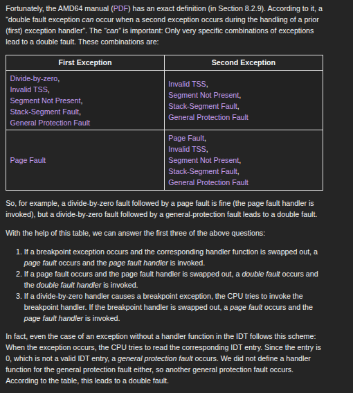

# Operating Sytem using rust


# Standalone Rust Binary for Embedded ARM

This guide explains how to build a standalone Rust binary targeting an embedded ARM Cortex-M microcontroller.

---

## 2. Linkage errors on native compilation

If you compile directly on your host machine, the Rust compiler assumes the presence of an OS and a C runtime:

- **Windows** → expects `msvcrt`  
- **Linux** → expects `glibc`  

Since bare-metal systems don’t have an operating system or a C runtime, you’ll encounter linkage errors if you try to compile without specifying the correct target.

---

## 3. Compiling for a different environment

To run on microcontrollers, we need to compile for a different environment than our host.  
Rust supports this through **target triples**, which define the architecture, vendor, operating system, and ABI.

---

## 4. Find your environment

To check your current toolchain and default compilation environment, run:


```sh
rustc --version --verbose
```

## Understanding `thumbv7em-none-eabihf` Target Triple

This document explains what each part of the Rust target triple `thumbv7em-none-eabihf` means.

---

## 1. Architecture
- **`thumbv7em`**  
  - Refers to the ARM Cortex-M4 / Cortex-M7 microcontrollers.  
  - The `thumb` prefix indicates the **Thumb instruction set** (a compressed 16/32-bit instruction set).  
  - `v7em` = ARMv7E-M architecture profile.  
  - This profile supports hardware multiply, optional floating-point, DSP instructions, and better interrupt handling.

---

## 2. Vendor
- **`none`**  
  - Indicates that this is a **bare-metal target**.  
  - No operating system or vendor-specific ABI.  
  - You’re directly targeting the hardware without an OS layer.

---

## 3. Operating System
- **`none`** (again implied)  
  - Confirms there’s no operating system like Linux, Windows, etc.  
  - All runtime/OS-like behavior must be provided by you (startup code, panic handling, etc.).

---

## 4. ABI (Application Binary Interface)
- **`eabihf`**  
  - Stands for **Embedded Application Binary Interface, Hard Float**.  
  - `eabi` = ABI used for ARM embedded systems (bare metal).  
  - `hf` = hardware floating-point, meaning floating-point operations are handled directly by the FPU (Floating Point Unit) if available.

---

## 5. Typical Use-Cases
- Writing **firmware** for microcontrollers like Cortex-M4 and Cortex-M7.  
- Applications in:  
  - Embedded systems.  
  - IoT devices.  
  - Robotics.  
  - Real-time systems (RTOS or bare metal).  
- Useful when performance and low-level control are critical.

---

## 6. Tooling & Ecosystem
- Rust cross-compilation uses `rustup target add thumbv7em-none-eabihf`.  
- Requires a cross toolchain like **`arm-none-eabi-gcc`** for linking.  
- Debugging often involves **OpenOCD**, **GDB**, or vendor-specific debuggers.  
- Often paired with crates like:  
  - [`cortex-m`](https://crates.io/crates/cortex-m) – low-level access to Cortex-M features.  
  - [`cortex-m-rt`](https://crates.io/crates/cortex-m-rt) – runtime support.  
  - [`embedded-hal`](https://crates.io/crates/embedded-hal) – hardware abstraction layer.

---

## 7. Key Notes
- Programs built for this target do **not use `std`**, but instead rely on `#![no_std]`.  
- You must define your own **entry point** (via `#[entry]` in `cortex-m-rt`, or `_start` manually).  
- Memory layout and startup sequence are defined in a **linker script**.  
- Debugging/logging often requires semihosting or ITM (Instrumentation Trace Macrocell).

---

## 8. Summary
The target triple `thumbv7em-none-eabihf` means:

- **Architecture:** ARM Cortex-M4/M7 (Thumb, ARMv7E-M).  
- **Vendor:** none (bare metal).  
- **OS:** none (no operating system).  
- **ABI:** Embedded ABI with hardware floating point.  

👉 It is the **go-to Rust target** for ARM Cortex-M4 and Cortex-M7 microcontrollers with FPU support.


targetting the system 
cargo build --target thumbv7em-none-eabihf


## alternatively we can also pass some arguments to the linker to avoid it looking for glib

```javascript
# Linux
cargo rustc -- -C link-arg=-nostartfiles
# Windows
cargo rustc -- -C link-args="/ENTRY:_start /SUBSYSTEM:console"
# macOS
cargo rustc -- -C link-args="-e __start -static -nostartfiles"
```
## Rust analyzer
it comes with vs code and it runs the cargo check
each time u try to save the file
it runs 

```cargo check --all-target ```

### this cmd line checks all the module binary , library,test and bench

#### test comes with std library ,without that it is of no use


# Minimum kernal

1. we wil be creating the kernel now
2. bootloader creation requrie the assembly language henc we do bw using the pre created loader

3. now we do be needing the inline
assmebly code for that i do be using the asm macro

4. this macro is nightly so we do be required to use the nightly verison for ,some reason this
feature has yet not been able to make its way into stable phase depite being three years old 

5. we are tragetting cisc x86 x64 architecture 

6. we are using the custom triple target with some configuration specific to our os


## This is the linux cisc x86 version
```
{
    "llvm-target": "x86_64-unknown-linux-gnu",
    "data-layout": "e-m:e-p270:32:32-p271:32:32-p272:64:64-i64:64-i128:128-f80:128-n8:16:32:64-S128",
    "arch": "x86_64",
    "target-endian": "little",
    "target-pointer-width": "64",
    "target-c-int-width": 32,
    "os": "linux",
    "executables": true,
    "linker-flavor": "gcc",
    "pre-link-args": ["-m64"],
    "morestack": false
}
```

6. so data-layout tells about the system  how much data in bytes do each data type will contain

## our custom target configuration

```
{
    "llvm-target": "x86_64-unknown-none",
    "data-layout": "e-m:e-p270:32:32-p271:32:32-p272:64:64-i64:64-i128:128-f80:128-n8:16:32:64-S128",
    "arch": "x86_64",
    "target-endian": "little",
    "target-pointer-width": "64",
    "target-c-int-width": 32,
    "os": "none",
    "executables": true,
    "linker-flavor": "ld.lld",
    "linker": "rust-lld",
    "panic-strategy": "abort",
}
```

8. (Note that, in contrast to the Cargo.toml option, this target option also applies when we recompile the core library later in this post. So, even if you prefer to keep the Cargo.toml option, make sure to include this option.)

9. so crate core will be recompiled
accordingly to our configuration

10. disablize the stack ponter optimization,because we are creating the interrupt ,
system interrupt that we do encounter in typical os environment like linux ,windows we aret rying to replicate something like that

11. add "disable-redzone": true, to the configuration file

12. 
```
{
    "llvm-target": "x86_64-unknown-linux-gnu",
    "data-layout": "e-m:e-p270:32:32-p271:32:32-p272:64:64-i64:64-i128:128-f80:128-n8:16:32:64-S128",
    "arch": "x86_64",
    "target-endian": "little",
    "target-pointer-width": "64",
    "target-c-int-width": 32,
    "os": "linux",
    "executables": true,
    "linker-flavor": "gcc",
    "pre-link-args": ["-m64"],
    "morestack": false,
    "disable-redzone": true,

}

```
13. there is something called the simd(single instruction multiple data) these are hard to handle when interrupt occur

14. but disabling this simd will cause the float vlaues to not work

15. float are then simulated using the software approach

something is called the soft-float this tells that the target will be using the soft-floats
```
"rustc-abi": "x86-softfloat"

```
16. now the configuration looks like
```
{
    "llvm-target": "x86_64-unknown-none",
    "data-layout": "e-m:e-p270:32:32-p271:32:32-p272:64:64-i64:64-i128:128-f80:128-n8:16:32:64-S128",
    "arch": "x86_64",
    "target-endian": "little",
    "target-pointer-width": "64",
    "target-c-int-width": 32,
    "os": "none",
    "executables": true,
    "linker-flavor": "ld.lld",
    "linker": "rust-lld",
    "panic-strategy": "abort",
    "disable-redzone": true,
    "features": "-mmx,-sse,+soft-float",
    "rustc-abi": "x86-softfloat"
}

```
14. now we want recompile the crate every time we build the crate

```
build-std = ["core","compiler_builtins"]
```

15. another crate is used by the core crate


### 1. Set up nightly Rust
- Added a `rust-toolchain` file with:

16. adding the nightly verison of the code
```
 rustup component add rust-src --toolchain nightly
```

17. now building the crate with the configured target
```
cargo +nightly build -Zbuild-std=core,compiler_builtins --target x86_64-unknown-none.json
```

18. now for displaying the output to the console or the screen 

19. something called vga hardware is used to displaying

20. there is a vga map buffer that is mapped to the vga hardware

21. there are 25 lines

22. each line contains 80 character cells

23. these charcter cell can display ascii and background color 
using ansii code

24. . For printing “Hello World!”, we just need to know that the buffer is located at address 0xb8000 and that each character cell consists of an ASCII byte and a color byte.

25. run the script using
cargo +nightly build -Zbuild-std=core,compiler_builtins --target custom_target.json

26. run the qemu cmd
qemu-system-x86_64 \
  -drive format=raw,file=target/custom_target/debug/bootimage-os_rust.bin \
  -vnc :0

27. now run the vncviewer
vncviewer 127.0.0.1:5900

28. remember the bootloader requires the earlier version of the volatile that is between 0.2 to 0.6
use volatile version volatile = "0.2.6"


## Memory Related Intrinsics

When we recompiled the crate, we pulled in `compiler_builtins`.  
This provides implementations of essential memory-related functions:

- **`memset`** → sets all bytes in a memory block to a given value  
- **`memcpy`** → copies one memory block into another  
- **`memcmp`** → compares one memory block with another  

### Why is this a problem?

- Normally, these functions are **provided by the C standard library**.  
- But when building an **operating system for a CISC architecture**,  
  there is **no operating system by default**, hence **no C library available**.  

This results in **missing symbol errors** when the compiler expects `memcpy`, `memset`, or `memcmp`.

---

### Possible Ways of Resolving the Problem

#### 1. Write Your Own Implementations
You could implement `memcpy`, `memset`, and `memcmp` manually.  

⚠️ **Warning**: This is very risky.  
For example:  

```rust
#[no_mangle]
pub unsafe extern "C" fn memset(bytes: *mut u8, value: u8, count: usize) {
    for i in 0..count {
        *bytes.add(i) = value;
    }
}


## Possible Solutions

### 1. Implement Intrinsics Manually (⚠️ Risky)
- Create custom implementations of `memset`, `memcpy`, and `memcmp`.  
- Danger: risk of circular dependencies due to compiler desugaring.

### 2. Use `compiler_builtins` (✅ Recommended)
- Enable the intrinsics provided by `compiler_builtins`.  
- This avoids missing symbol errors and provides well-tested implementations.

---
```
## Conclusion

For bare-metal Rust (without an OS or C standard library):
- **Don’t reinvent `memset`, `memcpy`, `memcmp`** unless you’re absolutely sure.  
- Instead, enable and use **`compiler_builtins`** to safely provide th


now for loop internally uses "IntoIterator::into_iter" trait method and this in turn internally uses memcpy again from the c standard library but we dont have any memcpy"


## Embedded Assembly Code

1. when using the IO/mappping we do require the 
assembly code to control the register data manipulation

2. there are two two instructions involved "in" and "out"

3. each device port is addrssed by some number
lets say the 0xf4 this is mostly empty
and in non use so we can create a fake  device 
and associate that to this
with register of size 4

4. we create the fake device by passing the 
arguments like
```
test-args = ["-device", "isa-debug-exit,iobase=0xf4,iosize=0x04","-vnc", ":0","-serial","stdio"]
```
5. now use the macro #![feature(asm_const)]
and import the crate use core::arch::asm
```
asm!(
      "out dx, al",
      in("dx") 0xf4 as u16,
      in("al") exit_code as i8,
      options(nostack, nomem)
  );
  ```
6. this is unsafe code compiler wont be able to determine it so wrap it inside of the unsafe

7. dx and al are register dx is of 16 bit and al is of 8 bit 
options(nostack,nomem) tells compiler that no stack has been modified and no memory has been modified

# Serial Interface

serial interface was used by the older machines 
so we gonna use that for ours as well it is a way of interacting with the devices

uart is the chip that is used to implement the 
serial interface 

* use the crate uart_16550

* Like the isa-debug-exit device, the UART is programmed using port I/O. Since the UART is more complex, it uses multiple I/O ports for programming different device registers. The unsafe SerialPort::new function expects the address of the first I/O port of the UART as an argument, from which it can calculate the addresses of all needed ports. We’re passing the port address 0x3F8, which is the standard port number for the first serial interface.

# Interrupt handling

### breakdown exception


# Double and triple fault

###  Function Item vs Function Pointer

* ## Function Item
When you write the name of a function (e.g. double_fault_handle), you’re not yet referring to a pointer — you’re referring to a zero-sized type (ZST) that uniquely identifies that function.
Think of it like a “token” that says this is the function itself, not its address.

* ## Function Pointer
What the set_handler_fn API expects is an actual function pointer, i.e., something of type:

extern "x86-interrupt" fn(InterruptStackFrame, _) -> !


That’s literally "a callable pointer to code with this ABI and signature".

```
extern "x86-interrupt" fn(InterruptStackFrame, _) -> !
```
##             Page fault
* The CPU tries to write to 0xdeadbeef, which causes a page fault.

* Like before, the CPU looks at the corresponding entry in the IDT and sees that no handler 

* function is defined. Thus, a double fault occurs.

* The CPU jumps to the – now present – double fault handler.


## Causes of double fault

* interrupt handle was not present for that paritcular interrupt

* handle for that interrupt was swapped out

* swapped out may mean that the interrupt was delivered but it did not triggerd the handle

#### Example

1. a breakpoint exception occurs, but the corresponding handler function is swapped out?

2. a page fault occurs, but the page fault handler is swapped out?

3. a divide-by-zero handler causes a breakpoint exception, but the breakpoint handler is swapped out?

4. our kernel overflows its stack and the guard page is hit?


### What "swapped out" could mean in this context

* **Not loaded into memory**
  - The handler code exists, but it’s currently not present in memory (e.g., swapped to disk in a virtual memory system).  
  - When the exception occurs, the CPU cannot find the handler’s instructions immediately.

* **Replaced with another handler**
  - The original handler was registered earlier but has been replaced with another one in the Interrupt Descriptor Table (IDT).  
  - This means the expected handler is not the one that gets executed.

* **Overwritten or corrupted**
  - The handler entry in the IDT may have been accidentally or maliciously modified.  
  - The CPU will jump to invalid or unintended code instead of the correct handler.

* **Handler causing its own exception**
  - Even if the handler is present, if it executes invalid operations (like a page fault or divide by zero), it raises a new exception.  
  - If that second exception cannot be handled, it may cause a *double fault* or even a *triple fault* (leading to a CPU reset).





